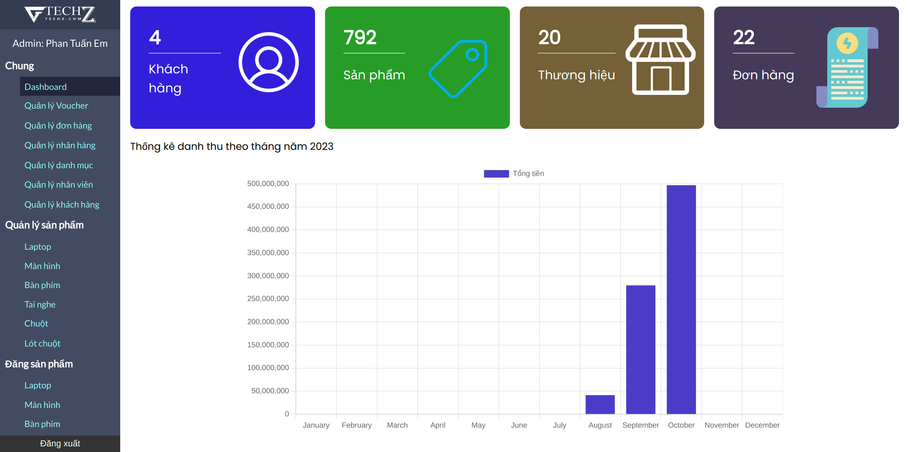
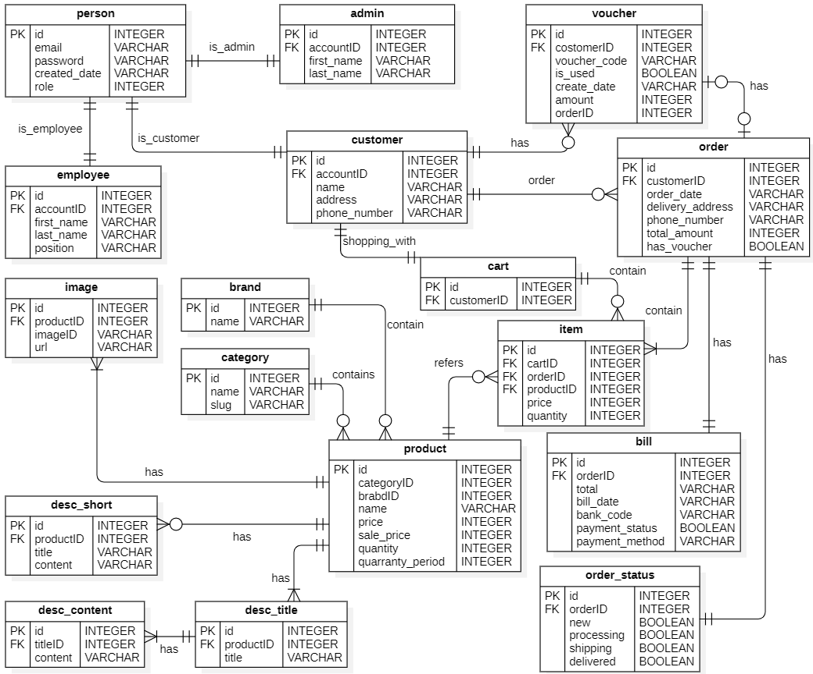

# XÂY DỰNG WEBSITE THƯƠNG MẠI ĐIỆN TỬ KINH DOANH LAPTOP CÓ TÍCH HỢP CỔNG THANH TOÁN VNPAY DÙNG NODEJS VÀ VUEJS
- Website bán laptop, màn hình máy tính, bàn phím, chuột máy tính, lót chuột máy tính.
- Website quản lý sản phẩm, đơn hàng, danh mục, nhãn hàng...
- Ngôn ngữ lập trình, framework: JavaScript, NodeJS, VueJS,… 
- Hệ quản trị cơ sở dữ liệu MySQL
- Cổng thanh toán trực tuyến: VNPAY (Công ty Cổ phần Giải pháp Thanh toán Việt Nam)
- Lưu trữ hình ảnh trên Google Drive: NodeJS tải ảnh lên Drive thông qua GOOGLE DRIVE API
- Cho phép đăng nhập bằng tài khoản Gmail

## Trang bán hàng

### Trang chủ

### Trang chi tiết sản phẩm

### Trang Best Seller

### Trang tìm kiếm sản phẩm

### Trang xem giỏ hàng

### Trang chi tiết đơn hàng đã đặt

## Trang quản lý

### Dashboard

### Quản lý đơn hàng

### Quản lý Voucher

## Entity Relationship Diagram

